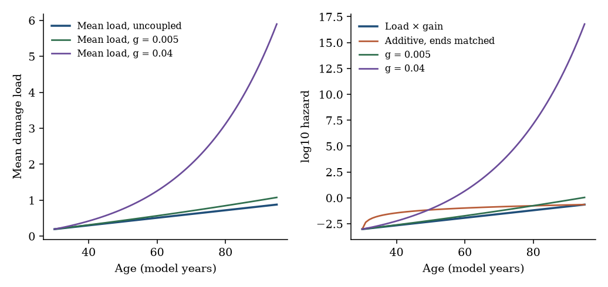
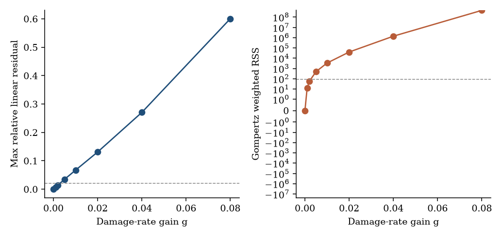
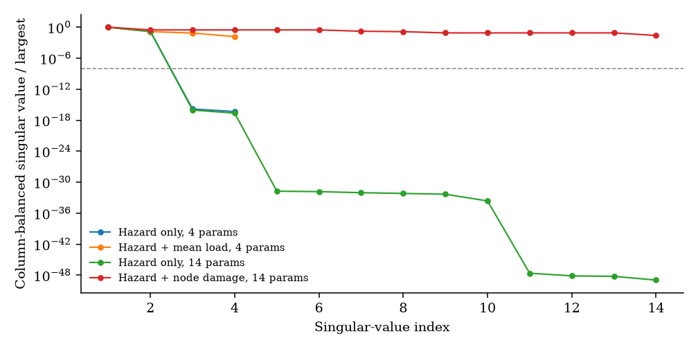
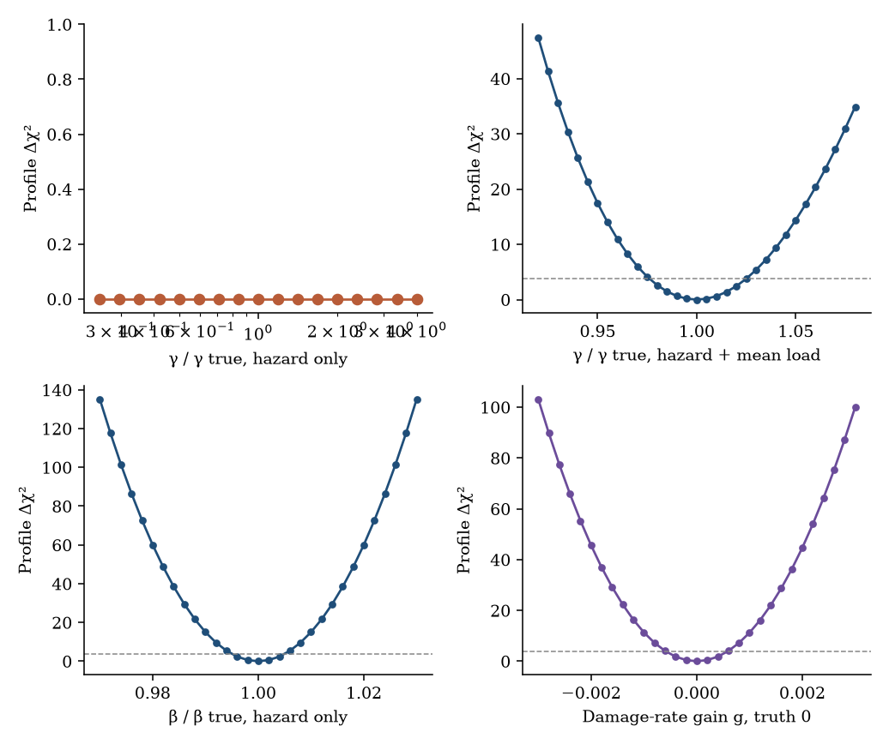
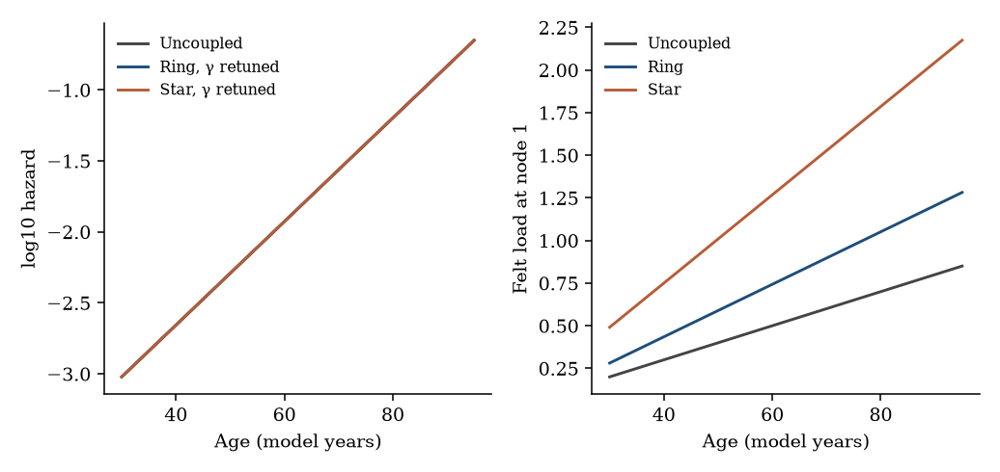

# Gompertz-like hazard from load×gain coupling of damaged subsystems: a computational biogerontology object

**Thesis #13. Computational research thesis** (series label NP-07)  
**Author:** Kelechi Emeka Ogbonna  
**Correspondence:** kelechiogbonna300@gmail.com · https://github.com/cloudynirvana/thesis-13-gompertz-load-gain-coupling  
**Date:** 21 September 2026  
**Format:** B.Sc. project chapters (Nile University style), written as a computational methods manuscript  
**Status:** In-silico hazard shapes and identifiability on a declared synthetic schedule. Not a life-table fit. Not a clinical result.  
**Citation style:** numbered Vancouver. A `doi:` field appears only where Crossref returned the record.  
**DOI:** none for this document. Do not invent one.

---

## Title page

**GOMPERTZ-LIKE HAZARD FROM LOAD×GAIN COUPLING OF DAMAGED SUBSYSTEMS: A COMPUTATIONAL BIOGERONTOLOGY OBJECT**

BY

**KELECHI EMEKA OGBONNA**

A COMPUTATIONAL RESEARCH THESIS  
(IN-SILICO KINETICS AND IDENTIFIABILITY STUDY)

SUBMITTED AS A CITEABLE MANUSCRIPT FOR JOURNAL / THESIS HANDOFF

PROJECT CONFLUENCE  
INDEPENDENT COMPUTATIONAL RESEARCH

SUPERVISOR: not appointed for this deposit

SEPTEMBER 2026

---

## Declaration

I, Kelechi Emeka Ogbonna, declare that this computational research thesis was carried out by me. The hazards, ranks and profiles reported here were produced by `sim/identifiability.py` at seed 20260921. They are not demographic measurements and not patient outcomes. No DOI, ORCID or journal acceptance was invented for this document.

_________________________     _______________________  
Kelechi Emeka Ogbonna         Date

---

## Abstract

Under what network-coupling assumptions does near-linear local damage produce Gompertz-like hazard in a simulated subsystem graph, and which of those assumptions are identifiable from public demographic schedules versus remaining free gain parameters? The calculations use six abstract nodes. Each node carries a damage coordinate. In the base generator the coordinates advance at constant rates, so every local trajectory is exactly linear in age. The organism-level hazard is either proportional to the mean load, or exponential in it. A second scalar, the damage-rate gain, lets each node feel the mean of the others.

Exact linearity plus an exponential map is an exact Gompertz hazard. The Gompertz slope on this generator is 0.0840 per model year, a doubling time of 8.25 years, chosen so the bend is of a familiar adult magnitude and not fitted to a life table. The same linear damage, passed through an additive map that matches the hazard at ages 30 and 95, has weighted residual 5776 against a two-parameter Gompertz fit. The χ² budget for that fit, at 64 degrees of freedom, is 83.68. The additive map is not Gompertz-like.

A demographic schedule records one log hazard at each integer age from 30 to 95. On that map the hazard-map gain γ and the mean load velocity v are not separate parameters. Their product is the Gompertz slope. The profile of γ, with v and the load intercept refitted, is flat from one quarter of the generating value to four times it: the largest Δχ² on that grid is below 10⁻²⁵. The profile of the product β = γv closes, with 95% bounds 0.08358 and 0.08442 on noiseless data. A synthetic mean-load channel removes the ridge. The fine-grid profile for γ is then 7.808 to 8.202, against a generating value of 8. Node-specific velocities stay free until the schedule records the nodes themselves. Fisher rank moves from 2 of 14, to 4 of 14, to 14 of 14 across those three maps.

Damage-rate coupling is a different gain. At the linear truth its profile interval is −5.79×10⁻⁴ to 5.81×10⁻⁴. Small positive values still leave every node inside the near-linear cut and can leave the best Gompertz curve inside the omnibus χ² budget, while a quadratic term is already detectable. Graph topology at fixed slope is invisible: a ring and a star reproduce the uncoupled hazard once γ, and for the star the baseline hazard, are allowed to move.

The draws are synthetic. The Human Mortality Database was not downloaded. Chapter Four is not a national mortality fit. Research only. Not a medical device, not a dose, and not a cure.

---

## Keywords

Gompertz hazard; load-gain coupling; subsystem graph; practical identifiability; profile likelihood; Fisher information; demographic schedule; synthetic surrogate; computational biogerontology; research only

---

## Table of Contents

DECLARATION  
ABSTRACT  
Table of Contents  
List of tables and figures  

CHAPTER ONE. INTRODUCTION  
1.1 Background to the study  
1.2 STATEMENT OF RESEARCH PROBLEM  
1.3 JUSTIFICATION OF STUDY  
1.4 AIM AND OBJECTIVES OF THE STUDY  
1.5 SIGNIFICANCE OF THE STUDY  
1.6 SCOPE OF THE STUDY  

CHAPTER TWO. LITERATURE REVIEW  
2.1 Gompertz slope, disposable soma, and hallmarks as context  
2.2 Network accounts of mortality, as related mechanisms  
2.3 A load×gain sentence, fenced  
2.4 What an age-specific hazard can identify  

CHAPTER THREE. MATERIALS AND METHODS  
3.1 Design  
3.2 Damage, felt load, and hazard  
3.3 Parameters  
3.4 Observation schedules  
3.5 Fisher information  
3.6 Profiles  
3.7 Coupling scan and two graphs  
3.8 What was not done  

CHAPTER FOUR. RESULTS  
4.1 Linear damage under two hazard maps  
4.2 Damage-rate gain  
4.3 Ranks  
4.4 Profiles of gain, slope, and coupling  
4.5 Two graphs, one hazard  

CHAPTER FIVE. DISCUSSION, CONCLUSION AND RECOMMENDATION  
5.1 Discussion  
5.2 Conclusion  
5.3 Recommendation  

REFERENCES  
DISCLAIMER  

---

## List of tables and figures

**Table 3-1.** Generating damage rates and initial loads.  
**Table 3-2.** Scalar constants.  
**Table 3-3.** Observation schedules.  
**Table 3-4.** Calls declared before the run.  
**Table 4-1.** Hazard maps on the same linear damage.  
**Table 4-2.** Damage-rate gain on the six-node graph.  
**Table 4-3.** Fisher ranks.  
**Table 4-4.** Profile intervals on the fine grids, and the flat ridge.  
**Table 4-5.** Graph retuning.

**Figure 4-1.** Mean load and log hazard under four generators.  
**Figure 4-2.** Linear residual of damage, and Gompertz lack of fit, against damage-rate gain.  
**Figure 4-3.** Column-balanced Fisher singular values.  
**Figure 4-4.** Profiles of the hazard-map gain, the Gompertz slope, and the damage-rate gain.  
**Figure 4-5.** Three graphs after the gain is allowed to compensate, and the felt load at one node.

Figures are computational diagnostics from seed 20260921. They are not measured mortality curves.

---

# CHAPTER ONE

## 1.0 INTRODUCTION

### 1.1 Background to the study

In 1825 Gompertz wrote the force of mortality as a function that rises exponentially with age [1]. Makeham later added a term that does not depend on age [2]. Adult human schedules often show a doubling of all-cause mortality on a scale of about eight years through the ages where most deaths occur [3]. The exponential description fails at the highest ages, where a plateau has been reported in carefully followed cohorts [4], and it is not a law of every species [5]. Those three sentences are the demographic setting. They are not parameter estimates for the model below.

Evolutionary theory has its own account of why a late-life rise exists at all. Kirkwood's disposable-soma argument treats maintenance as a cost that competes with reproduction, so perfect repair is not the predicted allocation [6,7]. A later review kept the point that ageing is not one disease with one coefficient [8]. The hallmarks lists assemble recurring biological features — genomic instability, telomere attrition, disabled macroautophagy, chronic inflammation, and the rest of an expanding catalogue — as a map of processes, not as a hazard function [9,10]. Strehler and Mildvan had already tried to connect a declining vitality reserve to the Gompertz slope [11]. Cohen and colleagues have argued that the right biological object is a complex system rather than a single lesion class [12]. None of those papers supplies the Jacobian in Chapter Three.

The modelling literature that does write a hazard from many parts is the related work of Chapter Two. Reliability arguments, interdependent networks, and binary subsystem failure can each put an exponential on a population curve [13–17]. A 2026 preprint frames the same curvature as a slow damage load multiplied by a systemic gain [18]. This thesis takes that multiplication as a mathematical split and asks when a simulated graph produces a Gompertz-shaped hazard, and which of the multipliers a schedule of hazards can see.

### 1.2 STATEMENT OF RESEARCH PROBLEM

Under what network-coupling assumptions does near-linear local damage produce Gompertz-like hazard in a simulated subsystem graph, and which of those assumptions are identifiable from public demographic schedules versus remaining free gain parameters?

The working form is narrow. Six nodes. Constant local velocities in the base generator, so damage is linear by construction. Two hazard maps, additive and exponential, on that same damage. One further scalar that couples the damage rates. The public-schedule question is asked of an observation map that returns a single hazard at each adult age. Collapse, if it happens, has to be read off the rank and the profiles of that map. It is not a statement about every mortality model [19,20].

A familiar way to miss the question is to freeze the load velocity, move the gain, watch the fit worsen, and call the gain identified. That path is a slice. A profile refits the velocity and the intercept [21]. Another miss is to treat a Gompertz slope as a measurement of the gain. The slope is a product.

### 1.3 JUSTIFICATION OF STUDY

Linear damage is what several biological stories assume at the scale of a lesion count. Exponential hazard is what a life table shows through mid and late adult ages [1,3]. The gap between those two shapes is easy to fill with a word such as "amplification" and then to treat every coefficient in the word as if the table had measured it. The justification for the study is the calculation that separates the shapes from the coefficients.

Raue and colleagues made the structural-versus-practical split operational for partially observed biological models, and Wieland and colleagues restate it: uniqueness in the input-output map, and a confidence set that stays bounded once noise and nuisance parameters are admitted [20,21]. Eisenberg and Hayashi treat the case where a coordinate is free and a combination of coordinates is not [22]. That is the case of a gain and a load velocity whose product is a slope. Gutenkunst and co-authors showed that a full-rank Fisher matrix can still be sloppy in unhelpful coordinates [23]. The raw condition numbers in this study are large because a per-year velocity and a log baseline do not share a unit. The reported practical statements are profiles and relative standard errors, not a relative cut on those raw eigenvalues.

The Human Mortality Database is the public object a demographer would fit [24]. It was not downloaded. The null space of a pure age-to-hazard map is algebraic. It does not depend on which country's rates sit in the vector, so long as the vector is still a list of hazards against age. The widths of the intervals do depend on the noise, and the noise here is synthetic.

Thesis #18 formalises a coupling-tensor λ_min criterion; the object here is hazard emergence from load×gain on a subsystem graph [25].

The study is not justified as a device, a rejuvenation protocol, or a claim that any node label is an organ diagnosis [26,27].

### 1.4 AIM AND OBJECTIVES OF THE STUDY

The aim is to determine which coupling assumptions turn near-linear node damage into a Gompertz-shaped hazard, and which of the gain and load parameters that hazard schedule identifies.

The objectives are:

1. Generate exactly linear node damage and compare an exponential hazard map with an additive map that matches the hazard at the ends of the age window.
2. Scan a damage-rate gain on the six-node graph and record, at each value, whether local damage stays inside the near-linear cut and whether the hazard stays inside the Gompertz cut.
3. Compute Fisher ranks for the hazard schedule, for the same schedule plus a mean-load channel, and for the same schedule plus node-resolved damage.
4. Profile the hazard-map gain, the Gompertz slope, and the damage-rate gain, and repeat the gain and slope profiles on one noisy draw.
5. Show two fixed graphs that reproduce one hazard when the gain is free, and that separate when the gain is held fixed.
6. Keep the surrogate label on every numerical claim, and keep clinical translation outside the aim.

Non-aims. Fitting a downloaded life table. Reading a Gompertz slope as a measured biological gain. Editing the vector field until the ridge disappears and then reporting the edited model as if it were the original.

### 1.5 SIGNIFICANCE OF THE STUDY

The useful product is a distinction among objects that a single plotted log-hazard collapses. An exponential map of a linear load, an additive map of the same load, a weak coupling inside the damage equation, and a graph that can be absorbed into the gain, are not one mechanism [22,26]. On this generator they do not even share a null space. That fact is local to the equations in Section 3.2. It is still the sort of fact a later worker can check without believing a clinical sentence.

There is a second distinction inside the exponential map. The schedule determines the slope and the intercept of log hazard. It does not determine the gain once the load velocity is free [21,22]. The profiles are there so that a sentence of the form "the gain was 8" has a figure to fail against. Saltelli and colleagues ask models to expose the assumptions on which a number depends [26]. May's warning is the same demand, aimed at biology that borrows equations more readily than it audits them [27].

What the significance is not: a survival benefit, a frailty threshold, or a reason to intervene on a person [3,26].

### 1.6 SCOPE OF THE STUDY

In scope. Six nodes with constant velocities. An exponential map and an endpoint-matched additive map. A scalar damage-rate gain through the mean of the other nodes. A ring and a star, each with one weight. Ages 30 through 95. Gaussian Fisher information with variances taken from a synthetic exposure. Profile likelihood on the hazard-map gain, on the Gompertz slope, and on the damage-rate gain. One noisy draw at the seed above.

Out of scope. The Human Mortality Database and any other national series [24]. Stochastic binary failure, repair queues, and a mortality plateau [4,17,29]. A global differential-algebra certificate. Any map from these parameters to a treatment, a plasma-exchange schedule, or an age reversal [18,26].

---

# CHAPTER TWO

## 2.0 LITERATURE REVIEW

### 2.1 Gompertz slope, disposable soma, and hallmarks as context

Gompertz's 1825 letter is a statement about the force of mortality in a life-contingency calculation [1]. Makeham's 1860 paper keeps an exponential in age and adds a constant [2]. Modern biodemography has used that exponential as a compact description of adult human mortality and has also documented where it bends [3,4]. Comparative schedules show species whose mortality does not rise in that way [5]. A model that emits a straight line on a log-hazard plot is therefore reproducing one empirical pattern, under one window, not a biological identity.

The disposable-soma account is an evolutionary argument about allocation, not a differential equation for six nodes [6,7]. It matters here only as the reason a maintenance term is allowed to be incomplete: the generator may accumulate damage at a constant rate without an apology. Kirkwood's later essay is cited for the same restraint. Ageing, in that essay, is not a single target with a single coefficient [8]. The hallmarks papers are cited in the same spirit. They name recurring features of aged tissue [9,10]. They do not name v or γ. Using a hallmark as a node label would suggest a measurement this repository does not contain. The nodes are numbered.

Strehler and Mildvan connected a linear decline in a vitality reserve to an exponential hazard by putting the reserve in an exponent, against a stressed environment [11]. The exponential map in Section 3.2 is in that family: linear load, exponential hazard. It is not their physiological model, and the stresses they discussed are not inputs here. Cohen and colleagues ask ageing biology to treat interacting systems as the object of study [12]. The present object is a small deterministic graph with an explicit observation map. It is one way of making that request numerical. It is not a review of the biology.

### 2.2 Network accounts of mortality, as related mechanisms

Several constructions already turn many parts into a Gompertz curve. Gavrilov and Gavrilova obtain Gompertz-like failure from redundant elements that are used up [13]. Vural, Morrison and Mahadevan study ageing as damage on an interdependent network [14]. Farrell, Mitnitski, Rockwood and Rutenberg, and a companion paper with the same authors, use a network of health deficits to speak to frailty and to the information in a frailty index [15,16]. Flietner, Heidergott, den Hollander, Lindner, Parvaneh and Strulik derive Gompertz mortality from a deficit network under a mean-field assumption and a homogeneity assumption, and they state when the derivation stops being accurate [28]. Ledberg shows an exponential rise from a queue whose repair rate declines linearly with age, and shows that the exponential is insensitive to several details of the queue [29].

Nielsen, Jensen, Mitarai and Bhatt start from a different discrete object. Subsystems fail as binary events. Interdependence makes each failure raise the chance of others. The population hazard can then look Gompertzian. They relate the construction to Rothman's sufficient-component cause model: a subsystem failure is a component cause, and a fatal pattern of failures is a sufficient cause [17,30]. The interdependence is essential in their account. Without it, the acceleration is not exponential.

Those papers are related mechanisms. They are not the generator in Chapter Three, and their biological or clinical discussions are not results of this thesis. The generator here is continuous damage on six nodes, an explicit load, and an explicit gain, with a Fisher matrix and a profile at the end. It does not re-simulate binary failure, a frailty index, or a repair queue. Where Chapter Four finds a Gompertz shape, the finding is local to these equations.

### 2.3 A load×gain sentence, fenced

Sottas has put the same split in prose: primary lesions as a damage load, and a systemic communication architecture as a gain that turns a slow input into late-life acceleration [18]. The preprint also argues for signalling reset and discusses interventions whose time scale would be hard to explain by slow repair alone. Those sentences are the author's programme. They are not hypotheses of this study. The calculation does not contain a plasma-exchange term, a reprogramming term, or a reversal experiment. The word "gain" below means the scalar γ in the hazard, or the scalar g in the damage rates. It does not mean a therapeutic leverage.

The useful part of the framing, for this thesis, is the separation. If the load is near-linear and the hazard is exponential, the exponent has to come from the map or from a coupling that bends the load. Section 3.2 writes both possibilities so that a profile can say which coefficient moved.

### 2.4 What an age-specific hazard can identify

Bellman and Åström defined structural identifiability as uniqueness in the input-output map, noise aside [19]. A single output, the hazard at age, is a severe map. Raue and colleagues use the profile likelihood when the model is only partly observed: fix one coordinate, re-optimise the others, and see whether the χ² rises at both ends of the scan [21]. Kreutz, Raue, Kaschek and Timmer discuss the same object as a way to separate a flat structural direction from a shallow statistical one [31]. A set that hits the edge of a wide scan is not certified as infinite. It is not certified as bounded either [21]. The scans below state which case occurred.

When a coordinate is free, a function of several coordinates may still be bounded. That is the subset-profiling situation of Eisenberg and Hayashi [22]. The Gompertz slope is that function for the exponential map. Wieland and colleagues restate the structural-versus-practical split for a systems-biology audience [20]. The split is the design of Chapter Three. The vector field of local damage does not change between the additive map and the exponential map. The output map does.

A relative eigenvalue cut on an unscaled Fisher matrix is a poor practical test when one column is a constant and another is multiplied by age. Gutenkunst et al. already warned that eigenvalue ranges can reflect geometry rather than a single dead parameter [23]. Chapter Three therefore reports two structural ranks that agree — an absolute floor on the raw eigenvalues, and a column-balanced singular-value count — and it reports practical claims through profiles and relative Cramér–Rao sketches. The sketches are local Gaussian calculations. They are not posteriors [20,23].

---

# CHAPTER THREE

## 3.0 MATERIALS AND METHODS

### 3.1 Design

The exposure, the noise, and the one noisy draw are a synthetic surrogate. No life table was downloaded [24].

The generator is fixed. Seed 20260921. Six nodes, indexed 1 to 6. The indices are not organs and not diagnoses. Ages are the integers 30, 31, …, 95, so there are 66 ages. Time since age 30 is t = a − 30, in model years. Software is `sim/identifiability.py`. The linear-damage hazard is closed form. The coupled damage uses the matrix exponential of a 6×6 rate, checked against the scalar solution for the mean.

### 3.2 Damage, felt load, and hazard

Node damage in the base generator is

dDi/da = vi, &nbsp;&nbsp; Di(30) = Di,0,

so

Di(a) = Di,0 + vi t.

The mean load is L(a) = (1/6) Σi Di(a) = L0 + v̄ t, with L0 and v̄ the means of the initial loads and of the velocities.

The exponential map, called load×gain below, is

μ(a) = μb exp(γ L(a)).

On the log scale that is log μ = log μb + γ L0 + (γ v̄) t. The observable intercept and slope are

α = log μb + γ L0, &nbsp;&nbsp; β = γ v̄.

Any change that preserves α and β preserves the hazard. In particular, replacing (γ, v̄, L0) by (λγ, v̄/λ, L0/λ) leaves both α and β fixed. The gain is free along that ray. A second ray fixes γ and trades log μb against L0.

The additive map uses the same L(a). It is the straight line in μ that matches the exponential map at age 30 and at age 95. It is the comparison that asks whether the bend requires the exponential, or whether any rising curve would have been called Gompertzian.

Damage-rate coupling replaces the constant velocities with

dDi/da = vi + g (mean of Dj for j ≠ i).

The coupling matrix is (11T − I)/5. Its action on the all-ones direction is the identity, so the mean m(a) obeys dm/da = v̄ + g m. For g ≠ 0,

m(t) = egt L0 + v̄ (egt − 1)/g,

and the g → 0 limit is the linear load. The hazard remains μ = μb exp(γ m). The log hazard is then a constant plus a multiple of egt. The rate g sits in the exponent. The products γ L0 and γ v̄ still enter only as a pair of coefficients, so a pure rescaling of γ against (L0, v̄) remains a null direction at nonzero g. The trade of log μb against L0 at fixed γ does not.

A felt load on a fixed graph uses a nonnegative matrix A that does not depend on age:

Fi = Di + (A D)i, &nbsp;&nbsp; LA = meani Fi.

Because D is affine in t, LA is affine in t. An exponential map of LA is still an exact Gompertz hazard. Its slope is γ times the slope of LA. Matching a target slope is a choice of γ. Matching the intercept may also move μb.

### 3.3 Parameters

**Table 3-1.** Generating node values. Model units. Not fitted to an assay.

| Node | vi | Di,0 |
| --- | ---: | ---: |
| 1 | 0.010 | 0.20 |
| 2 | 0.012 | 0.18 |
| 3 | 0.009 | 0.22 |
| 4 | 0.011 | 0.19 |
| 5 | 0.013 | 0.21 |
| 6 | 0.008 | 0.17 |

**Table 3-2.** Scalar constants. The slope β was placed near the familiar adult doubling scale [3]. It is not an estimate from a life table.

| Symbol | Role | Value |
| --- | --- | ---: |
| v̄ | Mean of vi | 0.0105 |
| L0 | Mean of Di,0 | 0.195 |
| γ | Hazard-map gain | 8 |
| μb | Baseline factor in the exponential map | 2.0×10⁻⁴ |
| β | γ v̄ | 0.0840 per year |
| doubling time | log(2)/β | 8.25 years |

The ring puts weight 0.45 on each node's successor. The star puts weight 0.30 on each edge between node 1 and every other node, in both directions. Those weights are fixed before the run.

### 3.4 Observation schedules

Exposure at age a is E(a) = max(2×10⁵ exp(−0.035 t), 500). It is a shrinking risk set, declared in the script, not a census. If deaths were Poisson with mean μ E, the delta method would give a standard deviation 1/√(μ E) for log μ. The study uses that formula with the generator's own μ, and it treats the resulting σ(a) as known weights. Re-estimating σ from data would be a second-order change. It was not made.

**Table 3-3.** Schedules compared on the same ages.

| Code | What is recorded | Noise |
| --- | --- | --- |
| P | log μ(a) at the 66 ages | σ(a) = 1/√(μ E), from the linear generator |
| PL | P, plus the mean load L(a) | independent sd 0.02 on L |
| PN | P, plus every Di(a) | independent sd 0.02 on each node |

Schedule P is the observation map of a public age-specific hazard. Schedules PL and PN are auxiliary channels. They are not frailty indices and not biomarker panels. The standard deviation 0.02 is a modelling choice, in the units of Table 3-1.

On the linear generator, μ(30) = 9.518×10⁻⁴, μ(60) = 1.183×10⁻² and μ(95) = 0.2238, a 235-fold rise. The log-hazard standard deviations at those three ages are 0.0725, 0.0348 and 0.0147. One noisy draw adds N(0, σ²) to log μ, and N(0, 0.02²) to the mean load, at seed 20260921. One draw is not a sampling distribution of the profile [21,31].

### 3.5 Fisher information

Observations are Gaussian with the variances in Table 3-3. For the linear map the Jacobian is analytic. For the damage-rate model the Jacobian of log μ with respect to (log μb, γ, v̄, L0, g) is analytic, including the g → 0 limit of the partial derivatives. The Fisher matrix is JT W J with W the diagonal matrix of 1/σ².

An eigenvalue is counted as a numerical zero when it lies below 10⁻⁴. That floor sits under the signal eigenvalues of this design and above the floating-point null cluster. A second rank counts singular values of the weighted Jacobian after each column has been scaled to unit length, with a relative tolerance of 10⁻⁸. The two ranks are required to agree before a rank is quoted as structural. Dead columns, those with negligible norm, are not counted as identifiable directions.

Where the matrix is full rank by that rule, the diagonal of the inverse is reported as a local Cramér–Rao sketch. Relative standard errors divide those sketches by the absolute values of the generating parameters. The sketch is not a posterior [20,23].

The four-parameter block is (log μb, γ, v̄, L0). The fourteen-parameter block appends the six velocities and the six initial loads. The coupled block is the four-parameter block plus g.

### 3.6 Profiles

A profile fixes one coordinate on a grid, refits the others inside explicit bounds, and records the weighted residual sum of squares [21]. The wide grid for γ runs from 0.25 to 4 times the generating value, at 17 geometric nodes. The fine grid runs from 0.92 to 1.08 times that value, at 33 linear nodes. The slope grid runs from 0.97 to 1.03 times β, at 31 nodes. The wide grid for g runs from −0.02 to 0.08. The fine grids are −0.003 to 0.003 when the truth is 0, and 0.016 to 0.024 when the truth is 0.02.

Bounds on free parameters are those in the script. The hazard-only profile of γ is started both at the generating point and at the analytic compensator (v̄, L0) → (v̄/λ, L0/λ). Both starts are required to reach a negligible residual, so the flatness is not an artefact of starting on the ridge.

The χ² threshold for one interesting parameter is 3.841. A profile is called flat when the χ² spread on the grid is below 0.5. It is called closed on the grid when both endpoints lie above 3.841. The reported interval is the linear interpolation of Δχ² to 3.841 on the fine grid. Interpolation on the wide grid pulls a quadratic bowl inward and is not used for the numbers in Chapter Four.

Noiseless data equal the model mean. The coupled profiles are scored with the σ(a) of the linear generator, so the noise budget does not move with g.

### 3.7 Coupling scan and two graphs

The damage-rate scan uses g in {0, 0.001, 0.002, 0.005, 0.01, 0.02, 0.04, 0.08}, fixed before the run. At each value the script records the linearity of every node and the lack of fit of the best Gompertz curve.

**Table 3-4.** Calls. Cuts were written into the script before the ranks were read as a conclusion.

| Call | Rule |
| --- | --- |
| Near-linear damage | Every node has R² ≥ 0.995 against age, and the largest absolute linear residual is at most 0.02 of that node's fitted increment |
| Gompertz-like hazard | Weighted residual of the best log μ = α + β t is at most the 95th percentile of χ² on 64 degrees of freedom |
| Curvature detectable | Linear-versus-quadratic likelihood ratio above 3.841 |
| Flat profile | Δχ² spread below 0.5 on the scanned grid |
| Closed profile | Both grid endpoints above 3.841 |

The χ² critical value on 64 degrees of freedom is 83.68. An R² cut alone is not enough: a gentle bow can keep R² above 0.995. The relative residual is there for that bow.

For each graph the script solves for the γ, and if needed the log μb, that match α and β of the uncoupled exponential map. It also records the log-hazard gap when γ is held at 8 and μb is held at 2×10⁻⁴.

### 3.8 What was not done

No life table was fitted [24]. Binary failure, repair queues, and an old-age plateau were not simulated [4,17,29]. Global identifiability software was not run. The exposure weights were not learned. No dose, schedule, or clinical threshold was computed. The Sottas preprint's interventional claims were not tested [18].

---

# CHAPTER FOUR

## 4.0 RESULTS

### 4.1 Linear damage under two hazard maps

Every node trajectory in the base generator is exactly linear. The minimum R² is 1 and the maximum relative residual is a round-off. Figure 4-1 shows the mean load beside three other means that are not linear, and the log hazards that those loads produce.

The exponential map is an exact Gompertz hazard. Its weighted residual against the best two-parameter line is numerically zero, the fitted slope is 0.0840, and the likelihood ratio against a quadratic is numerically zero. The additive map, forced to meet the same hazard at ages 30 and 95, has weighted residual 5776. That is far above 83.68. The quadratic coefficient on the log hazard is −7.448×10⁻⁴, and the likelihood ratio for that quadratic term is 3551. Table 4-1 records the calls. The same six linear trajectories are Gompertz-like under the exponential map and not Gompertz-like under the additive map. The coupling assumption that produces the shape is the map, not the damage.

**Figure 4-1.** Left: mean load. The uncoupled generator is the straight line. Right: log10 hazard. The additive curve meets the exponential curve at the two ends of the window and bends away between them. Model years, not a calendar series.

**Table 4-1.** Calls for the two maps on identical linear damage. Residuals use the schedule-P weights.

| Map | Gompertz RSS | Quadratic LR | Gompertz-like |
| --- | ---: | ---: | --- |
| Load×gain | ~0 | ~0 | Yes |
| Additive, ends matched | 5776 | 3551 | No |

### 4.2 Damage-rate gain

Table 4-2 and Figure 4-2 follow g. At g = 0 the row repeats the exact linear, exact Gompertz case. At g = 0.001 the worst node still has R² 0.9999 and a relative residual 0.00723, inside both near-linear cuts, and the Gompertz residual is 12.62, inside 83.68. The same 12.62 is the likelihood ratio for a quadratic term, and 12.62 exceeds 3.841, so curvature is detectable while both omnibus calls still pass. At g = 0.002 the pattern is the same with a larger lack of fit: relative residual 0.0143, Gompertz residual 56.40, quadratic ratio 56.39.

At g = 0.005 the relative residual is 0.0346, so the near-linear call fails, even though the worst R² is still 0.9971 and would have passed an R²-only rule. The Gompertz residual is 490.8. From there the lack of fit grows quickly. At g = 0.04 and g = 0.08 the log10 hazard at age 95 is 16.8 and 201. Those two values are not demographic magnitudes. They mark a coupling that has left the regime in which the output can be compared with a life table. The mean of the network solution matches the scalar formula at every scanned g, with a maximum absolute gap below 10⁻¹⁰ up to g = 0.02 and still below 10⁻⁸ at g = 0.08.

**Figure 4-2.** Left: largest relative linear residual across the six nodes. The dashed line is the 0.02 cut. Right: weighted residual of the best Gompertz fit. The dashed line is 83.68. The vertical scale on the right is linear near zero and logarithmic above 1.

**Table 4-2.** Pre-specified damage-rate gains. "Near-linear" uses both cuts in Table 3-4. "Gompertz-like" uses the omnibus residual, not the quadratic ratio.

| g | Min R² | Max relative residual | Near-linear | Gompertz RSS | Quadratic LR | Gompertz-like |
| ---: | ---: | ---: | --- | ---: | ---: | --- |
| 0 | 1 | ~0 | Yes | ~0 | ~0 | Yes |
| 0.001 | 0.9999 | 0.00723 | Yes | 12.62 | 12.62 | Yes |
| 0.002 | 0.9995 | 0.0143 | Yes | 56.40 | 56.39 | Yes |
| 0.005 | 0.9971 | 0.0346 | No | 490.8 | 490.4 | No |
| 0.01 | 0.9900 | 0.0669 | No | 3393 | 3383 | No |
| 0.02 | 0.9668 | 0.131 | No | 4.017×10⁴ | 3.970×10⁴ | No |

Near-linear local damage and a Gompertz-like omnibus fit occur together at g = 0, 0.001 and 0.002. Only g = 0 is free of detectable curvature.

### 4.3 Ranks

Table 4-3 is the structural summary. On schedule P the four mechanistic scalars have rank 2, and the fourteen node-wise parameters have rank 2. The column-balanced singular values agree. The two analytic null directions of Section 3.2 — baseline against load intercept, and gain against velocity — each have projection 1.000 onto the numerical null space of the four-parameter matrix.

Adding the mean load raises both ranks to 4. The six velocity differences and the six initial-load differences remain invisible, which is why the fourteen-parameter rank stops at 4. Node-resolved damage raises the rank to 14 of 14. Figure 4-3 shows the column-balanced spectra: a cliff after the rank, rather than a long sloppy tail inside it.

The coupled model, five parameters, has rank 3 at g = 0 and rank 3 at g = 0.02. At both values the two null-vector entries on g are at most about 10⁻¹¹ in absolute value, so the damage-rate gain is not one of the null directions. At g = 0 the weighted residual along each analytic tradeoff is numerically zero. At g = 0.02 the gain–velocity rescaling still has weighted residual about 10⁻¹¹, and the baseline–load tradeoff has weighted residual 3.51×10⁵. The second null direction at nonzero g is real — the rank says so — and it is not that baseline–load swap.

The observable reparameterisation (α, β) has rank 2 of 2. Its Cramér–Rao standard error for β is 2.167×10⁻⁴, a relative standard error of 0.258%.

Where schedule PL makes the four-parameter matrix full rank, the relative standard errors are 0.684% for log μb, 1.26% for γ, 1.23% for v̄ and 2.50% for L0. On schedule PN the relative standard error for γ is 0.565%, the six velocities lie between 0.99% and 1.62%, and the six initial loads lie between 2.21% and 2.86%.

**Figure 4-3.** Singular values after each weighted column is scaled to unit length, divided by the largest singular value. The dashed line is the 10⁻⁸ relative tolerance. Hazard-only matrices drop after two values. The node-resolved matrix keeps fourteen.

**Table 4-3.** Structural ranks. The eigenvalue floor is 10⁻⁴. The column rank is the unit-column singular-value count. They agree in every row.

| Block | Schedule | Parameters | Rank |
| --- | --- | ---: | ---: |
| (log μb, γ, v̄, L0) | P | 4 | 2 |
| (log μb, γ, v̄, L0) | PL | 4 | 4 |
| Node velocities and initial loads, plus γ and log μb | P | 14 | 2 |
| Same fourteen | PL | 14 | 4 |
| Same fourteen | PN | 14 | 14 |
| Four scalars plus g, truth g = 0 | P | 5 | 3 |
| Four scalars plus g, truth g = 0.02 | P | 5 | 3 |
| (α, β) | P | 2 | 2 |

### 4.4 Profiles of gain, slope, and coupling

The hazard-only profile of γ is flat. From 0.25γ to 4γ the largest Δχ² is 3.0×10⁻²⁶. At every node of that grid the refitted product γv equals 0.0840. The truth-start optimisation, at half and at double the generating gain, reaches a residual below 10⁻²⁵ without being handed the compensator. The ridge is the likelihood, not the initial guess. One noisy draw leaves the same profile flat: the largest Δχ² is 1.5×10⁻¹². Noise does not identify a coordinate that the mean map cannot see.

The profile of β on noiseless data closes. The fine interpolation gives 0.08358 to 0.08442, which matches the Wald interval from the standard error in Section 4.3 (0.0840 ± 1.96×2.167×10⁻⁴). On the one noisy draw the interpolated interval is 0.08296 to 0.08381. The interval still closes. Its centre has moved. A single draw is not a coverage check.

With the mean load observed, the wide profile of γ closes, and the fine grid places the 95% bounds at 7.808 and 8.202. That half-width is 2.46% of the generating value, against 1.96 times the relative standard error 1.26%. The profile and the local sketch agree. On the noisy draw the fine bounds are 7.643 and 8.023. The gain is no longer a free parameter once a load channel exists, and it is still not a sharp point estimate at this noise level.

The damage-rate gain is the parameter the hazard schedule can see as curvature. At truth g = 0 the fine profile runs from −5.79×10⁻⁴ to 5.81×10⁻⁴. The value g = 0.001, which Table 4-2 still calls near-linear and Gompertz-like by the omnibus rules, lies outside that interval. At truth g = 0.02 the fine profile runs from 0.01983 to 0.02018. Figure 4-4 shows the flat ridge, the closed gain under a load channel, the slope, and the coupled gain at truth zero.

**Figure 4-4.** Top left: hazard-only profile of γ/γtrue, on a vertical scale that would show a rise of 1. The curve stays on zero. Top right: the same coordinate when a mean load is observed; the dashed line is 3.841. Bottom left: the Gompertz slope. Bottom right: the damage-rate gain when the truth is zero. Noiseless generator.

**Table 4-4.** Profiles. Flat means the wide hazard-only grid. Closed intervals are fine-grid interpolations to Δχ² = 3.841.

| Target | Data | Result |
| --- | --- | --- |
| γ, schedule P | Noiseless | Flat; max Δχ² = 3.0×10⁻²⁶; γv = 0.0840 on the grid |
| γ, schedule P | One noisy draw | Flat; max Δχ² = 1.5×10⁻¹² |
| β, schedule P | Noiseless | 0.08358 to 0.08442 |
| β, schedule P | One noisy draw | 0.08296 to 0.08381 |
| γ, schedule PL | Noiseless | 7.808 to 8.202 |
| γ, schedule PL | One noisy draw | 7.643 to 8.023 |
| g, truth 0 | Noiseless | −5.79×10⁻⁴ to 5.81×10⁻⁴ |
| g, truth 0.02 | Noiseless | 0.01983 to 0.02018 |

### 4.5 Two graphs, one hazard

Table 4-5 is the topological counterpart of the ridge. With γ retuned, the ring (weight 0.45) uses γ = 5.517 and keeps μb = 2.000×10⁻⁴. The star (weight 0.30) uses γ = 5.367 and moves μb to 1.970×10⁻⁴, because the felt-load intercept is not the uncoupled intercept. In both cases the maximum gap in log hazard, against the uncoupled exponential map, is below 10⁻¹⁴. Figure 4-5 shows the three log hazards on top of one another, and the felt load at node 1, which is not the same curve.

Held at γ = 8 and μb = 2×10⁻⁴, the same ring and star miss the uncoupled log hazard by 3.159 and 3.466 at the worst age. A coupling assumption that changes β is visible. A coupling assumption that can be absorbed into γ and μb is not, if the schedule is only P.

**Figure 4-5.** Left: log10 hazard after γ, and for the star also μb, have been chosen to match the uncoupled Gompertz curve. Right: felt load at node 1 on those same graphs, without that rescaling of the vertical axis. The hazards match. The node loads do not.

**Table 4-5.** Graph weights are fixed. "Gap" is the maximum absolute difference in natural log hazard against the uncoupled exponential map.

| Graph | γ free to match the slope | γ | μb | Gap |
| --- | --- | ---: | ---: | ---: |
| Uncoupled | Yes | 8 | 2.000×10⁻⁴ | ~0 |
| Ring | Yes | 5.517 | 2.000×10⁻⁴ | < 10⁻¹⁴ |
| Star | Yes | 5.367 | 1.970×10⁻⁴ | < 10⁻¹⁴ |
| Ring | No | 8 | 2.000×10⁻⁴ | 3.159 |
| Star | No | 8 | 2.000×10⁻⁴ | 3.466 |

---

# CHAPTER FIVE

## 5.0 DISCUSSION, CONCLUSION AND RECOMMENDATION

### 5.1 Discussion

The problem asked two questions. The first is a question about shapes. On this graph, near-linear local damage produces a Gompertz-like hazard when the hazard map is exponential in the load. It does not do so when the map is additive, even if the additive map is forced to share the hazard at the ends of the window. A damage-rate gain small enough to keep every node inside the near-linear cut (g = 0.001 and g = 0.002) still leaves the best Gompertz curve inside the omnibus χ² budget. The same values already support a quadratic term. The omnibus word "Gompertz-like" and the sharper word "no detectable curvature" are different calls, and Table 4-2 is there so they are not swapped.

The second question is about coefficients. A schedule with the observation map of a public age-specific hazard identifies α and β. It does not identify γ once v̄ and L0 are free, and it does not identify the six velocities once only their mean enters the hazard. The flat profiles, noiseless and noisy, are the practical form of that algebra [21,22]. The damage-rate gain is in a different position. It is a curvature parameter. Its profile closes around zero when the truth is zero, on a scale of about 6×10⁻⁴, and it closes around 0.02 when that is the truth. Graph topology joins the free list whenever a change in A can be undone by a change in γ and μb.

This is a narrower claim than the network papers in Chapter Two. Nielsen and colleagues show that interdependence of binary failures can be sufficient for a Gompertz shape [17]. Flietner and colleagues show under which mean-field assumptions a deficit network yields the same shape, and where the shape fails [28]. Ledberg shows a queue with declining repair [29]. The present result does not choose among those mechanisms. It says that, inside one continuous generator, the exponential map is sufficient, the additive map is not, and the gain in the exponential map is not a function of the hazard schedule.

The Sottas preprint uses the load×gain split to argue for a systemic reset [18]. Nothing in Chapter Four is evidence for or against that argument. The split was used because it is the cleanest way to put a linear load and an exponential hazard in one equation, and then to see the ridge.

The raw condition number of the four-parameter matrix under schedule PL is about 2.0×10⁸. That number is the condition of an unscaled coordinate system in which v̄ is a hundred times smaller than γ. The relative standard errors are of order one percent, and the profile of γ agrees with them. Quoting the condition number as if γ were practically free would repeat the sloppiness warning in the wrong place [23]. Quoting the relative errors as if they existed on schedule P would ignore the rank.

The synthetic exposure fixes the practical widths. A national table would move σ(a) and would therefore move the β interval and the g interval. It would not put a floor under the hazard-only profile of γ, because that profile is flat for any common set of weights: every γ on the ray produces the same mean curve. That is the sense in which the free gain is a property of public demographic schedules as a class of observation maps, while the numerical half-widths in Table 4-4 are properties of this surrogate [24].

The window stops at 95. A plateau beyond that age is outside the generator [4]. Species that do not follow Gompertz are outside it as well [5]. Six deterministic nodes are not a physiology [9,12].

### 5.2 Conclusion

Under the equations in Section 3.2, near-linear node damage produces an exact Gompertz hazard when the hazard is exponential in the mean load, and it does not when the hazard is additive in that load. A damage-rate gain up to 0.002 keeps the near-linear call and the omnibus Gompertz call, and it does not keep the log hazard free of detectable curvature. The damage-rate gain itself has a closed profile. The hazard-map gain does not, unless a load channel is added. Node velocities and graph topology remain free on a schedule that records only the hazard, whenever they can be absorbed into the mean slope and the baseline.

### 5.3 Recommendation

1. When a Gompertz slope is reported from a load×gain model, report β, or report γ only together with the gauge that fixed the load [22].
2. Prefer a profile of γ, with the load velocity refitted, over a slice that freezes the velocity [21].
3. If the scientific target is the gain, supply a load observation from outside the hazard schedule. Do not tighten the optimiser and leave the ray in place.
4. Keep the near-linear call and the Gompertz call separate from the quadratic likelihood ratio. State the cuts.
5. Treat network papers that derive a Gompertz shape as related mechanisms. Do not import their biological conclusions as findings about this ridge [17,28].
6. Leave rejuvenation, plasma exchange, dosing, and clinical decision rules outside papers of this type [18,26].
7. A document DOI, if one is minted later, belongs in `CITATION.cff` only after it exists.

---

## REFERENCES

Journal items use Vancouver form. DOI strings are those returned by Crossref for the cited version. The Zenodo item is not a Crossref record; the URL was resolved at doi.org on 21 September 2026. Internet items have no `doi:` field. This document has no DOI.

1. Gompertz B. On the nature of the function expressive of the law of human mortality, and on a new mode of determining the value of life contingencies. Philos Trans R Soc Lond. 1825;115:513-583. doi:10.1098/rstl.1825.0026.
2. Makeham WM. On the law of mortality and the construction of annuity tables. Assur Mag J Inst Actuar. 1860;8(6):301-310. doi:10.1017/S204616580000126X.
3. Vaupel JW. Biodemography of human ageing. Nature. 2010;464(7288):536-542. doi:10.1038/nature08984.
4. Barbi E, Lagona F, Marsili M, Vaupel JW, Wachter KW. The plateau of human mortality: demography of longevity pioneers. Science. 2018;360(6396):1459-1461. doi:10.1126/science.aat3119.
5. Jones OR, Scheuerlein A, Salguero-Gómez R, Camarda CG, Schaible R, Casper BB, et al. Diversity of ageing across the tree of life. Nature. 2014;505(7482):169-173. doi:10.1038/nature12789.
6. Kirkwood TBL. Evolution of ageing. Nature. 1977;270(5635):301-304. doi:10.1038/270301a0.
7. Kirkwood TBL, Holliday R. The evolution of ageing and longevity. Proc R Soc Lond B Biol Sci. 1979;205(1161):531-546. doi:10.1098/rspb.1979.0083.
8. Kirkwood TBL. Understanding the odd science of aging. Cell. 2005;120(4):437-447. doi:10.1016/j.cell.2005.01.027.
9. López-Otín C, Blasco MA, Partridge L, Serrano M, Kroemer G. The hallmarks of aging. Cell. 2013;153(6):1194-1217. doi:10.1016/j.cell.2013.05.039.
10. López-Otín C, Blasco MA, Partridge L, Serrano M, Kroemer G. Hallmarks of aging: an expanding universe. Cell. 2023;186(2):243-278. doi:10.1016/j.cell.2022.11.001.
11. Strehler BL, Mildvan AS. General theory of mortality and aging. Science. 1960;132(3418):14-21. doi:10.1126/science.132.3418.14.
12. Cohen AA, Ferrucci L, Fülöp T, Gravel D, Hao N, Kriete A, et al. A complex systems approach to aging biology. Nat Aging. 2022;2(7):580-591. doi:10.1038/s43587-022-00252-6.
13. Gavrilov LA, Gavrilova NS. The reliability theory of aging and longevity. J Theor Biol. 2001;213(4):527-545. doi:10.1006/jtbi.2001.2430.
14. Vural DC, Morrison G, Mahadevan L. Aging in complex interdependency networks. Phys Rev E. 2014;89(2):022811. doi:10.1103/PhysRevE.89.022811.
15. Farrell SG, Mitnitski AB, Rockwood K, Rutenberg AD. Network model of human aging: frailty limits and information measures. Phys Rev E. 2016;94(5):052409. doi:10.1103/PhysRevE.94.052409.
16. Mitnitski AB, Rutenberg AD, Farrell S, Rockwood K. Aging, frailty and complex networks. Biogerontology. 2017;18(4):433-446. doi:10.1007/s10522-017-9684-x.
17. Nielsen PY, Jensen MK, Mitarai N, Bhatt S. The Gompertz law emerges naturally from the inter-dependencies between sub-components in complex organisms. Sci Rep. 2024;14(1):1196. doi:10.1038/s41598-024-51669-5.
18. Sottas PE. From damage accumulation to systemic amplification: reframing the logic of late-life rejuvenation [preprint]. Zenodo; 2026 [cited 2026 Sep 21]. Available from: https://doi.org/10.5281/zenodo.20007684
19. Bellman R, Åström KJ. On structural identifiability. Math Biosci. 1970;7(3-4):329-339. doi:10.1016/0025-5564(70)90132-X.
20. Wieland FG, Hauber AL, Rosenblatt M, Tönsing C, Timmer J. On structural and practical identifiability. Curr Opin Syst Biol. 2021;25:60-69. doi:10.1016/j.coisb.2021.03.005.
21. Raue A, Kreutz C, Maiwald T, Bachmann J, Schilling M, Klingmüller U, et al. Structural and practical identifiability analysis of partially observed dynamical models by exploiting the profile likelihood. Bioinformatics. 2009;25(15):1923-1929. doi:10.1093/bioinformatics/btp358.
22. Eisenberg MC, Hayashi MAL. Determining identifiable parameter combinations using subset profiling. Math Biosci. 2014;256:116-126. doi:10.1016/j.mbs.2014.08.008.
23. Gutenkunst RN, Waterfall JJ, Casey FP, Brown KS, Myers CR, Sethna JP. Universally sloppy parameter sensitivities in systems biology models. PLoS Comput Biol. 2007;3(10):e189. doi:10.1371/journal.pcbi.0030189.
24. Barbieri M, Wilmoth JR, Shkolnikov VM, Glei DA, Jasilionis D, Jdanov D, et al. Data resource profile: the Human Mortality Database (HMD). Int J Epidemiol. 2015;44(5):1549-1556. doi:10.1093/ije/dyv105.
25. Ogbonna KE. Bounded adaptive coherence: a coupling-tensor minimum-eigenvalue criterion as a computational aging and cancer object [Internet]. Thesis #18 computational research thesis. 2026 [cited 2026 Sep 21]. Available from: https://github.com/cloudynirvana/thesis-18-bounded-adaptive-coherence
26. Saltelli A, Bammer G, Bruno I, Charters E, Di Fiore M, Didier E, et al. Five ways to ensure that models serve society: a manifesto. Nature. 2020;582(7813):482-484. doi:10.1038/d41586-020-01812-9.
27. May RM. Uses and abuses of mathematics in biology. Science. 2004;303(5659):790-793. doi:10.1126/science.1094442.
28. Flietner V, Heidergott B, den Hollander F, Lindner I, Parvaneh A, Strulik H. A unifying theory of aging and mortality. Sci Rep. 2025;15(1):28766. doi:10.1038/s41598-025-11454-4.
29. Ledberg A. Exponential increase in mortality with age is a generic property of a simple model system of damage accumulation and death. PLoS One. 2020;15(6):e0233384. doi:10.1371/journal.pone.0233384.
30. Rothman KJ. Causes. Am J Epidemiol. 1976;104(6):587-592. doi:10.1093/oxfordjournals.aje.a112335.
31. Kreutz C, Raue A, Kaschek D, Timmer J. Profile likelihood in systems biology. FEBS J. 2013;280(11):2564-2571. doi:10.1111/febs.12276.

---

## Disclaimer

Research manuscript. Not a medical device, not clinical decision support, not a diagnostic or therapeutic product, and not a protocol [26]. Hazards, ranks and profiles are properties of the synthetic generator. They are not national mortality rates and not patient outcomes. No document DOI is registered.

Deposit: https://github.com/cloudynirvana/thesis-13-gompertz-load-gain-coupling
